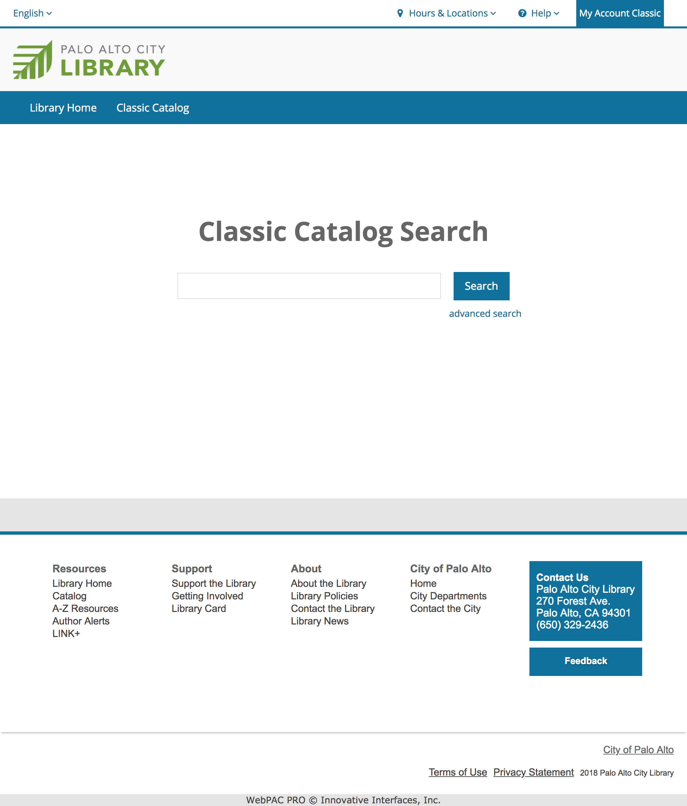
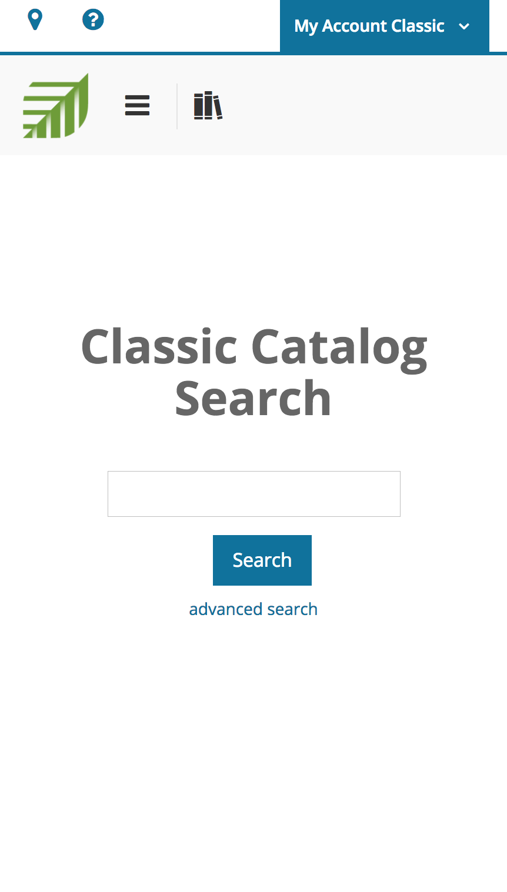
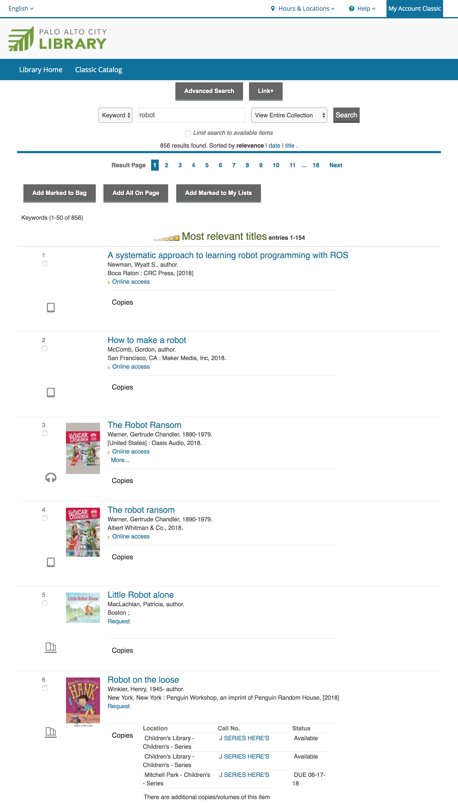
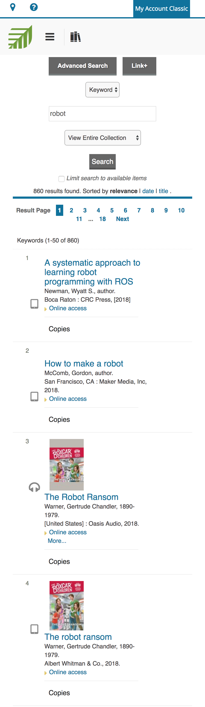
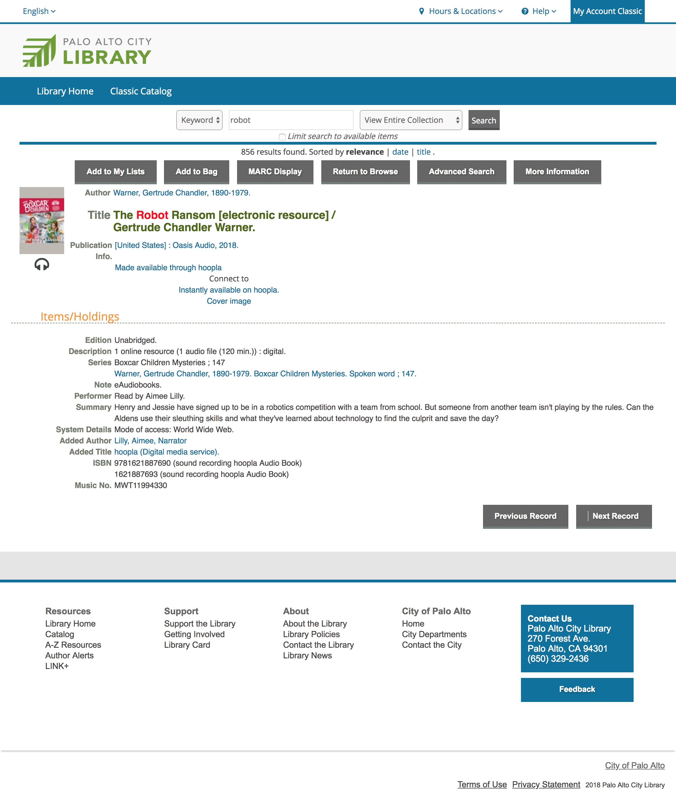
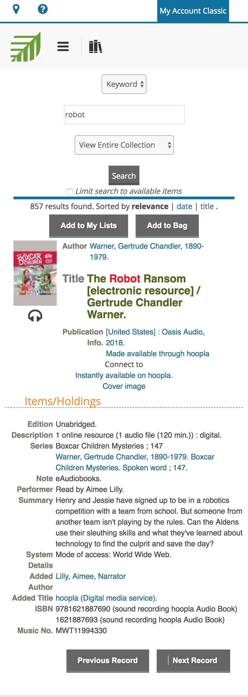
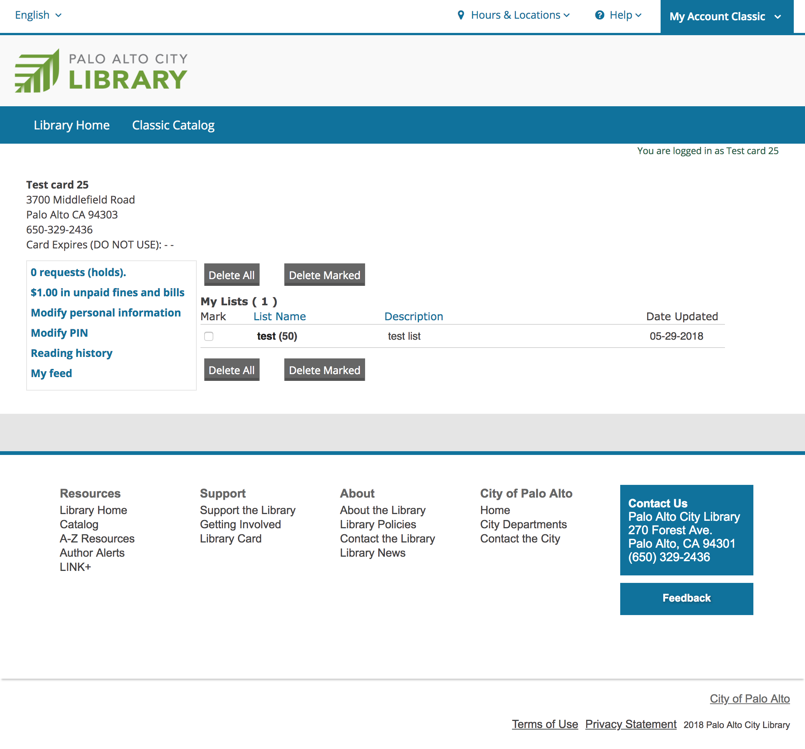
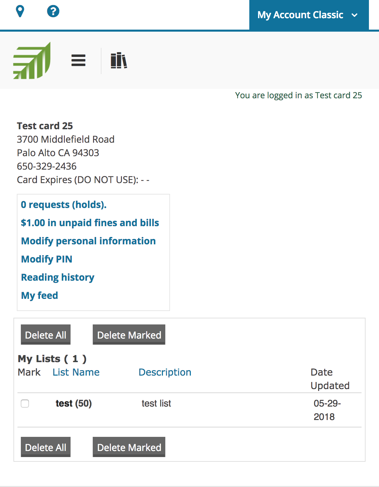

# Sierra Webpac BiblioCommons-like Skin

This is a BiblioCommons-like skin<a href="#1">1</a> for Sierra Webpac<a href="#2">2</a>, developed by Dan Lou at Palo alto City Library. The skin mimics the library's BiblioCommons website style and it is mobile friendly.

Many BiblioCommons libraries want to keep the Sierra Webpac as a backup catalog for  the following reasons:

* To meet the needs of library customers who just want to have a basic catalog to search and borrow items.
* Some functions are only available in Webpac for now, and make the Webpac pages look and feel like BiblioCommons will enhance user experience.
	* The self registration web page where customer first request a library card online.
	* The personal information modification web page where customers can opt in or out of SMS services.
* BiblioCommons uses APIs to talk to ILS. It is rare, but Webpac could serve as a backup in case the API services get interrupted.

This project attempts to keep the consistant look and feel of multiple library catalog websites, and to provide a more modern and user-friendly Webpac. 

This repository contains the Webpac files that got most heavily customized for the purpose, where I try to push the limits of Webpac and apply BiblioCommons style to it.

## Install

1. I recommend to install this first on your staging port or on your training server. Upload the Siera Webpac example set from Innovative Interfaces via Sierra Webmaster module if you have not already had a Webpac running on the specific port/server.
2. Clone or download this repository. Upload all files in `webpac` folder via Sierra Webmaster module. This will update existing files in Webpac and add new ones required by this new skin. 
3. Rename wwwoptions.txt to wwwoptions and restart Webpac.
4. Customize image files, CSS files and html files to match your library's specific style as needed. For example, use your library's own logo images. 

## Screenshots

### Main page/ Opac page view

 Desktop | Mobile 
----------|-----------
 |  

### Browse page view

 Desktop | Mobile 
----------|-----------
 |  

### Record view

 Desktop | Mobile 
----------|-----------
 |  

### Patron account view
 Desktop | Mobile 
----------|-----------
 |  

## Documentation

### CSS

Most of the customizations are for combining BiblioCommons style with Webpac code, and at the same time, make it mobile responsive:

* external_library_branding.css
* header_all.css
* style.css
* styles.css

### WWWOPTIONS

This is a speical beast in Webpac and it is very powerful.

* wwwoptions

Almost all buttons are customized here in order to get rid of or replace those classic but poor-quality icons that appear everywhere in Webpac.

Web Options also provide a way to control many other system generated code in Webpac, such as which HTML file to use for header and footer, what meta tags and scripts should get linked to in head in almost every HTML page, etc.. It also works with webpub.def file to control many crucial search/display functions and behaviors in Webpac. We did not touch any crucial functions in this repository.

### HTML

To make the CSS take effect in webpac, we need to heavily rewrite html code in webpac. 

#### Header and Footer

* toplogo.html
* toplogo_loggedin.html
* botlogo.html

Create brandnew header and footer in Webpac. You can bring in the exact same header and footer from BiblioCommons, including the sub menus in top navigation bar. Make sure you call out to BootStrap jquery and javascript files. 

	
	

In our case, we decided to simplify things a bit. The header and footer in Webpac do not contain many links to BiblioCommons. To further differentiate the two catalog interfaces, Webpac is in a different color.

#### Search Pages

Customize the main page, the main search page and the advanced search page:

* mainmenu.html
* opacmenu.html
* srchhelp_X.html

We decided to make the main search page (web path /search) and main page(web path /) the same. It contains a simple search box.

#### Account Pages

* modpinfo.html
* selfreg.html
* patronview_web.html

Most of the work is done to make these mobile responsive. These pages are very unfriendly for customization since the tables or divs in side often do not have a unique id or class.

#### Localization and Translation

I did some light localization in Chinese, Russian and Spanish:

* toplogo_chx.html
* toplogo_loggedin_chx.html
* mainmenu_chx.html
* opacmenu_chx.html
* srchhelp_X_chx.html
* toplogo_rus.html
* toplogo_loggedin_rus.html
* mainmenu_rus.html
* opacmenu_rus.html
* srchhelp_X_rus.html
* toplogo_spi.html
* toplogo_loggedin_spi.html
* mainmenu_spi.html
* opacmenu_spi.html
* srchhelp_X_spi.html

Please refer to Sierra Dcumentation if you want to have the website fully localized in a foreign language.

### Logo Images

* favicon.ico
* logo.png
* mobile_logo.png
* PAC_Library_Logo_leaf-150x150.png

---

1. BiblioCommons is a modern layer of online catalog. The CSS is mainly based on Bootstrap. It coexistes with library's Integrated library systems (ILSs) and creates a complete OPAC replacement.

2. Webpac is the online catalog interface for libraries that use the Sierra/Millennium ILS from Innovative Interfaces.

